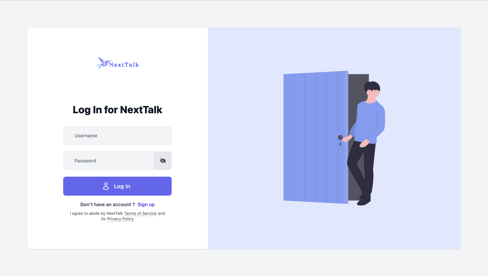
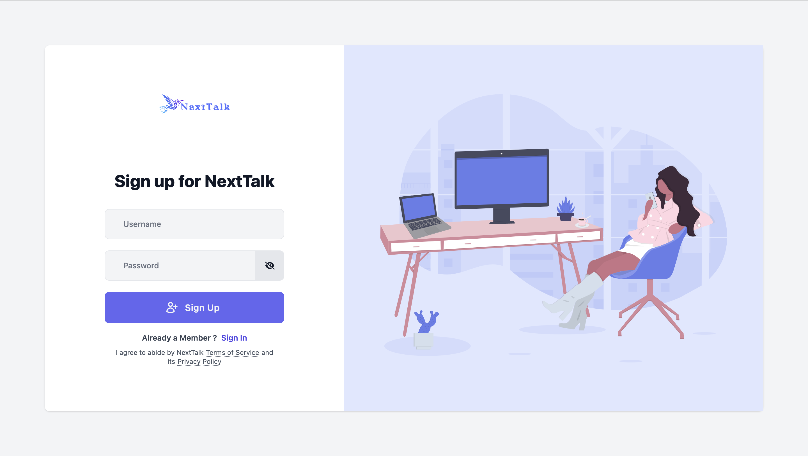
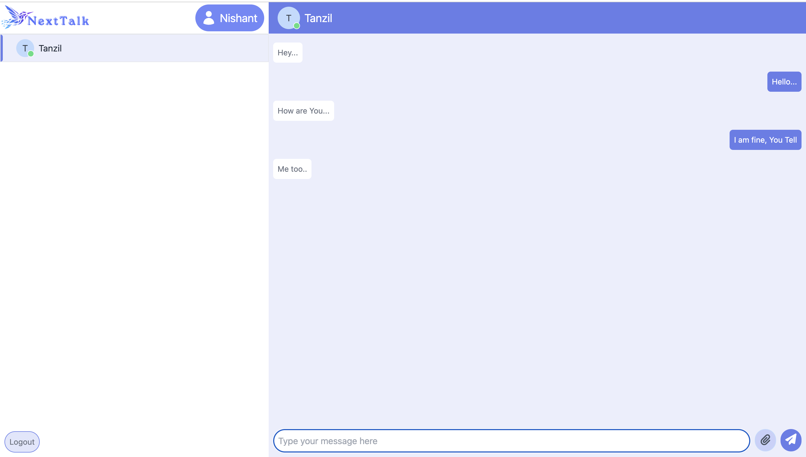
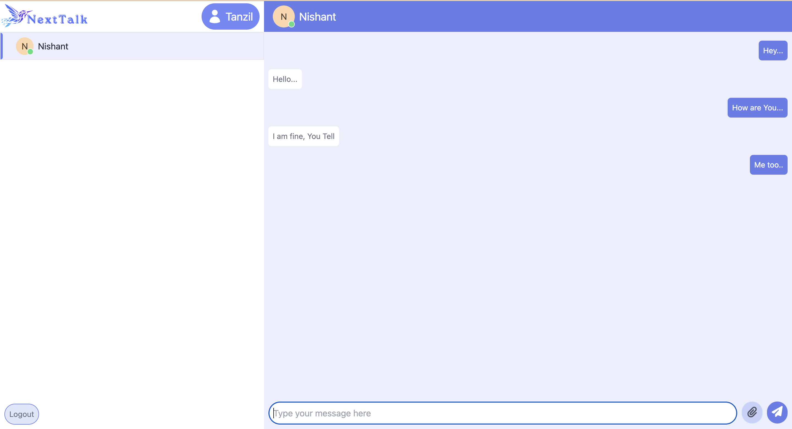
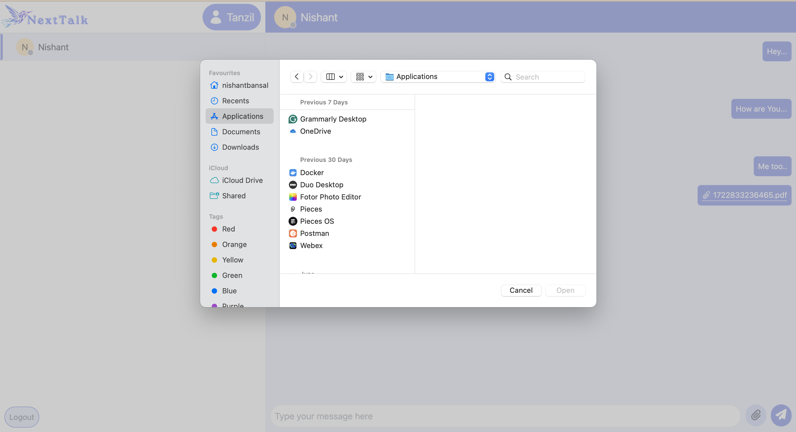

## NextTalk - [Site Link](https://nishant-nexttalk.netlify.app/)
# A Real Time Chat Application

## TechStack
1. **Frontend** :- React.js, TailwindCSS
2. **Backend** :- Node.js, Express, MongoDB, WebSockets

## Features
1. Sign In and Sign Up Pages for the Chat Application

2. Enabled real-time message updates on both sender and receiver sides for immediate communication, including an online/offline status indicator with green and grey dots.

3. Added functionality to share files seamlessly and made the website fully responsive.

**Note**: Don’t worry—your password is encrypted, so it remains secure and private. Additionally, only the sender and receiver can view the chat messages. The website displays all registered users in the sidebar, allowing you to connect and chat with anyone you choose.